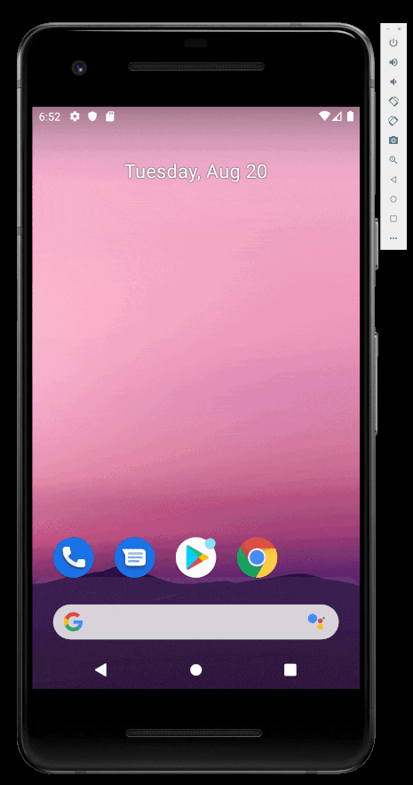

# AboutMe

## Description

Android app that uses a LinearLayout with a nested ScrollView to display a mini-bio and optimized with data binding.

## Features

The following functionality is complete:

* [x] Implement app using LinearLayout with nested ScrollView
* [x] Use data binding for optimization which removes the need to traverse the layout tree multiple times.
* [x] Store data in data classe objects instead of XML resources.
* [x] Display the input text without an underline.

## Demo

## Credits

Peter Akala

## License

See the [LICENSE](LICENSE.md) file for license rights and limitations (Apache License 2.0).
